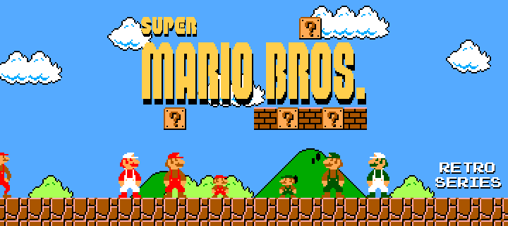
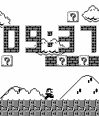
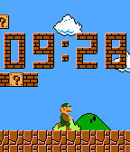
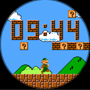

# Super Mario Bros. - Retro Series

   

Take a trip back in time to 1985 with this Super Mario Bros. watchface. Part of the Retro Series, this watchface walks through a small piece of the mushroom kingdom. Mario or Luigi will take a step every minute, and swap out for another pal every hour.

But... what is that? Is that... Mario? Why does he look so weird?

The Retro Series is a series of watchfaces based on retro games, powered by the Game Boy Color Graphics Advanced engine. This engine is an upgraded version of the GBC Graphics engine, bringing Pebble one step closer to the graphics of the Game Boy Advance. Check out the graphics library here: https://github.com/HarrisonAllen/pebble-gbc-graphics
