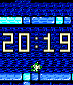
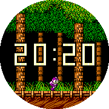
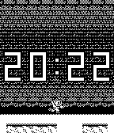

# Mega Man 2 - Retro Series

  

Mega Man 2 - Retro Series

Take a trip back in time to 1988 with this Mega Man 2 watchface. Part of the Retro Series, this watchface travels through each of the eight stages. Mega Man will step every few seconds, and switch out for another weapon each minute. Every hour, the stage will change!

The Retro Series brings retro games and graphics to the Pebble, powered by the Game Boy Color Graphics Advanced engine. This engine is an upgraded version of the GBC Graphics engine, one step closer to the graphics of the Game Boy Advance. Check out the graphics library here: https://github.com/HarrisonAllen/pebble-gbc-graphics

This watchface served as a test case for a GBA watchface generator. Check it out! https://github.com/HarrisonAllen/retro-watchfaces/tree/main/watchface-generator
