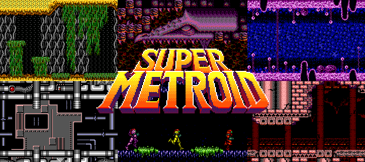
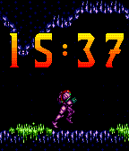
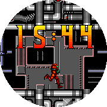

# Super Metroid - Retro Series

 

Super Metroid - Retro Series

Fly back to 1994 with Samus Aran with this Super Metroid watchface. Part of the Retro Series, join this bounty hunter as she navigates the interior of Zebes, tarversing through Crateria, Brinstar, Norfair, Maridia, and Tourian. Each minute samus will take a step through this animated parallax world, and each hour swaps out her suit between the Power Suit, Gravity Suit, and the Varia Suit.

The Retro Series brings retro games and graphics to the Pebble, powered by the Game Boy Color Graphics Advanced engine. This engine is an upgraded version of the GBC Graphics engine, one step closer to the graphics of the Game Boy Advance. Check out the graphics library here: https://github.com/HarrisonAllen/pebble-gbc-graphics

This watchface was set up using the GBA watchface generator. Check it out! https://github.com/HarrisonAllen/retro-watchfaces/tree/main/watchface-generator
