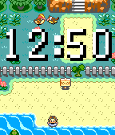
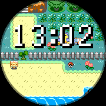
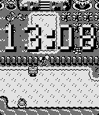

# Pokemon Generation 1 - Retro Series

  

Pokemon Generation 1 - Retro Series
Choose your Pokemon!

This animated watchface lets you travel in the Kanto region with up to 3 Pokemon by your side. Featuring the first generation of Pokemon, this watchface pays homage to the originals (Red, Blue, Yellow) whlie featuring updated graphics from the remakes (Fire Red, Leaf Green) by including all 151 of the original Pokemon.

The Retro Series brings retro games and graphics to the Pebble, powered by the Game Boy Color Graphics Advanced engine. This engine is an upgraded version of the GBC Graphics engine, one step closer to the graphics of the Game Boy Advance. Check out the graphics library here: https://github.com/HarrisonAllen/pebble-gbc-graphics