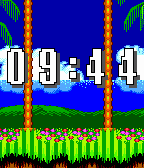
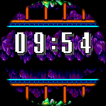
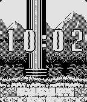

# Sonic the Hedgehog 2 - Retro Series

  

Sonic the Hedgehog 2 - Retro Series

Take a trip back in time to 1992 with this Sonic the Hedgehog 2 watchface. Part of the Retro Series, this watchface will take you through three zones: Emerald Hill Zone, Aquatic Ruin Zone, and Mystic Cave Zone! Sonic and Tails (& Knuckles) will take a step through the levels every few seconds, swapping out for each other every minute. Every hour, the zone will change!

The Retro Series brings retro games and graphics to the Pebble, powered by the Game Boy Color Graphics Advanced engine. This engine is an upgraded version of the GBC Graphics engine, one step closer to the graphics of the Game Boy Advance. Check out the graphics library here: https://github.com/HarrisonAllen/pebble-gbc-graphics

This watchface served as a test case for a GBA watchface generator. Check it out! https://github.com/HarrisonAllen/retro-watchfaces/tree/main/watchface-generator
